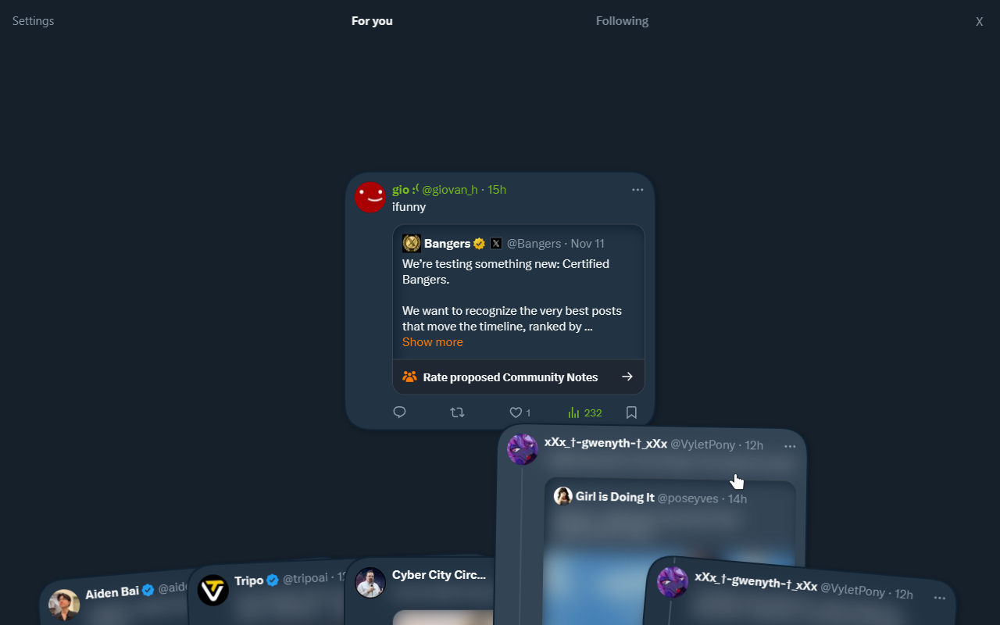

#  Tweets Against Humanity

Extension/Userscript to turn Twitter into a deck-building rougelike.

[Original demo video](https://twitter.com/rebane2001/status/1988251704437911664)

**Tweets Against Humanity** lets you browse Twitter (officially known as X) as if it were a card game. You are given a set of tweets, and you only get to pick one to read, discarding the other ones.

This makes browsing Twitter both fun and mindful, as it makes you more aware of the content you'd like to see, and helps avoid mindless doomscrolling due to the eventual decision fatigue.

## Installing

You can install this as either an extension or a userscript.

### Extension

Get the extension from an extension store:
#### [Chrome (and similar)](https://chromewebstore.google.com/detail/tweets-against-humanity/iffafbhcfbghbcbomboplepdbphdkjbi)

You can also download and install it manually:
- [Universal download for Chrome, Firefox, and other browsers](https://github.com/rebane2001/TweetsAgainstHumanity/releases/download/v1.0.1/TweetsAgainstHumanity_v1.0.1.zip)

### Userscript

Grab the userscript [from here](https://github.com/rebane2001/TweetsAgainstHumanity/raw/refs/heads/mane/extension/tweets-against-humanity.user.js) and install it with a userscript manager of your choice, such as [Violentmonkey](https://violentmonkey.github.io/) (recommended) or [Tampermonkey](https://www.tampermonkey.net/).

## Licensing

TAH is licensed under the [GNU General Public License v3.0](LICENSE).

TAH is not affiliated with Twitter, Cards Against Humanity, or Balatro (but feel free to reach out if you'd like it to be).
